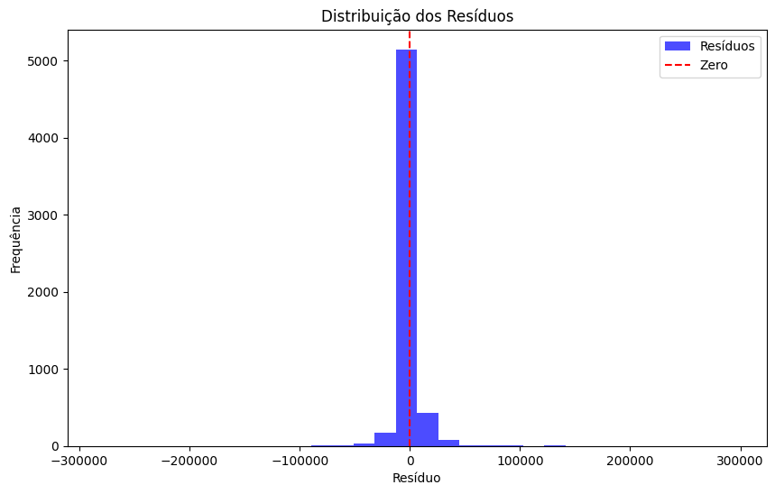
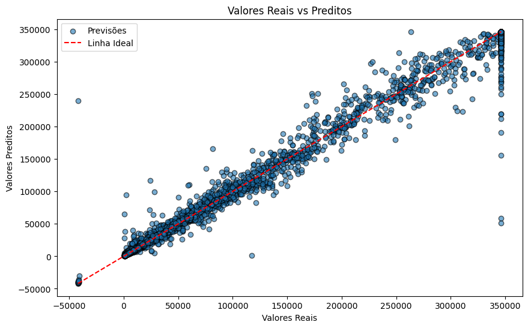

# **Relatório Final: Modelagem e Avaliação Preditiva**

## **1. Introdução**
Este relatório detalha o desenvolvimento de um modelo preditivo para estimar **Daily Active Users (DAU)** do aplicativo, abrangendo as etapas de **coleta e tratamento de dados**, **modelagem**, **validação** e **análise de resultados**. 
O objetivo principal foi identificar um modelo robusto e confiável para prever o DAU com base em variáveis disponíveis.

---

## **2. Coleta e Tratamento de Dados**

### **Fontes de Dados**
Os dados foram extraídos de quatro tabelas principais de um banco de dados SQL:
- **`ratings`**: Avaliações diárias, categorias e reviews.
- **`installs`**: Registros de novas instalações por aplicativo.
- **`desinstalacoes`**: Informações sobre desinstalações e perdas previstas.
- **`daumau`**: Dados de usuários ativos diários (**DAU**) e mensais (**MAU**).

### **Processo de Tratamento**
1. **Integração dos Dados**:
   - Mesclagem das tabelas utilizando `appId` e `date` como chaves principais.
2. **Tratamento de Valores Ausentes**:
   - Foram verificados os valores ausentes e na base de daumau, eles foram inputados atraves de um modelo de regressão linear para a variável de daureal (target), uma vez que ela possuia uma forte correlação com a variável de maudau.
   - Isso foi realizado mesmo tendo uma pequena porção de valores nulos nesta variável.
   - No mais, os outros valroes nulos foram dropados.  
3. **Tratamento de outliers**:
  - Os outliers foram identificados com analises de box plot, e tratados para se manter entre a distribuição de valores de 1% a 99%
4. **Criação de Features Temporais**:
   - Extração de colunas adicionais de dia, mês e ano para capturar padrões temporais, essas features foram criadas para nós termos mais featuers e melhorar o modelo
5. **Remoção de Features Irrelevantes**:
   - Exclusão de colunas redundantes como identificadores e `date`, que não contribuíam diretamente para a modelagem.

### Divisão dos dados 
Tamanho total do conjunto de dados: 36936 registros
Tamanho do conjunto de treinamento: 23638 registros (64.00%)
Tamanho do conjunto de validação: 5910 registros (16.00%)
Tamanho do conjunto de teste: 7388 registros (20.00%)
---

## **3. Modelagem e Treinamento**

### **Algoritmos Avaliados**
- **Random Forest Regressor**
- **Decision Tree Regressor**
- **Linear Regression**
- **CatBoost Regressor**
- **XGBoost Regressor**
- **LightGBM Regressor**

### **Modelo Selecionado: RandomForestRegressor**
Após uma análise criteriosa, o modelo **RandomForestRegressor**, este modelo apresenta o menor MAE e menor MAPE na validação, indicando um erro menor e maior precisão nas previsões, sendo o melhor modelo considerando essas métricas.

#### **Hiperparâmetros Otimizados**
 - `bootstrap`: False, 
 - `max_depth`: 30, 
 - `max_features`: 'sqrt', 
 - `min_samples_leaf`: 1, 
 - `min_samples_split`: 2, 
 - `n_estimators`: 500

### **Validação**
- Métricas finais no conjunto de validação:
  - MAE: 4476.8664
  - MSE: 155309702.4780
  - R²: 0.9903
  - MAPE: 0.1364

---

## **4. Validação e Avaliação do Modelo**

### **Métricas de Performance**
| **Métrica**       | **Valor**     |
|--------------------|---------------|
| MAE (Erro Médio Absoluto)        | 4476.87      |
| MSE (Erro Médio Quadrático)      | 155309702.48 |
| RMSE (Raiz do Erro Quadrático)   | 12462.33      |
| R² (Coeficiente de Determinação) | 0.9903         |
| MAPE (Erro Percentual Médio)     | 13.64%         |
| MedAPE (Erro Percentual Mediano) | 4.76%          |

#### 1. MAE (Erro Médio Absoluto)  
**Fórmula:**
\[
\text{MAE} = \frac{1}{n} \sum_{i=1}^{n} \left| y_{\text{real}, i} - y_{\text{predito}, i} \right|
\]

**Interpretação:**
- Mede o **erro médio absoluto** entre os valores reais e os valores previstos.
- É expresso na mesma unidade que a variável-alvo, facilitando a interpretação prática.

**Resultado Obtido:**
- **MAE:** 4476.87  
  Isso significa que, em média, o modelo erra suas previsões em aproximadamente **4477 unidades da métrica alvo**.

---
#### 2. MSE (Erro Quadrático Médio)  
**Fórmula:**
\[
\text{MSE} = \frac{1}{n} \sum_{i=1}^{n} \left( y_{\text{real}, i} - y_{\text{predito}, i} \right)^2
\]

**Interpretação:**
- Mede o **erro quadrático médio**, penalizando erros maiores de forma mais significativa devido ao uso do quadrado das diferenças.
- É útil para avaliar a magnitude dos erros, mas menos intuitivo porque está na escala quadrática da variável-alvo.

**Resultado Obtido:**
- **MSE:** 155,309,702.48  
  Esse valor reflete o impacto de erros maiores no desempenho do modelo.

---

#### 3. RMSE (Raiz do Erro Quadrático Médio)  
**Fórmula:**
\[
\text{RMSE} = \sqrt{\text{MSE}}
\]

**Interpretação:**
- É a **raiz quadrada do MSE**, trazendo a métrica de volta à mesma unidade da variável-alvo.
- Fornece uma visão intuitiva sobre o tamanho médio dos erros.

**Resultado Obtido:**
- **RMSE:** 12,462.33  
  Em média, o erro padrão das previsões do modelo é de **12,462 unidades da métrica alvo**.

---
#### 4. R² (Coeficiente de Determinação)  
**Fórmula:**
\[
R^2 = 1 - \frac{\sum \left( y_{\text{real}, i} - y_{\text{predito}, i} \right)^2}{\sum \left( y_{\text{real}, i} - \bar{y}_{\text{real}} \right)^2}
\]

**Interpretação:**
- Mede a proporção da variabilidade da variável-alvo que é explicada pelo modelo.
- Varia entre 0 (o modelo não explica nada) e 1 (o modelo explica toda a variabilidade).

**Resultado Obtido:**
- **R²:** 0.9903  
  O modelo explica **99.03% da variabilidade** nos dados, indicando um excelente desempenho.

---

#### 5. MAPE (Erro Percentual Absoluto Médio)  
**Fórmula:**
\[
\text{MAPE} = \frac{100}{n} \sum_{i=1}^{n} \left| \frac{y_{\text{real}, i} - y_{\text{predito}, i}}{y_{\text{real}, i}} \right|
\]

**Interpretação:**
- Mede o **erro percentual médio absoluto**, proporcionando uma visão relativa do erro em relação aos valores reais.
- É útil para interpretar erros em cenários onde a escala dos dados varia.

**Resultado Obtido:**
- **MAPE:** 13.64%  
  Em média, as previsões do modelo possuem um erro percentual absoluto de **13.64%** em relação aos valores reais.

---

#### 6. MedAPE (Erro Percentual Absoluto Mediano)  
**Fórmula:**
\[
\text{MedAPE} = \text{Mediana}\left( \left| \frac{y_{\text{real}, i} - y_{\text{predito}, i}}{y_{\text{real}, i}} \right| \right) \times 100
\]

**Interpretação:**
- Mede o **erro percentual absoluto mediano**, sendo uma métrica mais robusta contra outliers, pois utiliza a mediana dos erros.
- Indica o erro percentual típico para metade das observações.

**Resultado Obtido:**
- **MedAPE:** 4.76%  
  Para 50% das observações, o erro percentual absoluto do modelo é de, no máximo, **4.76%**, sugerindo uma boa precisão para a maioria dos casos.

---

### **Interpretação**
-  **R² de 0.9903:** o modelo explica quase toda a variabilidade dos dados.
- **MAPE de 13.64%:** erros percentuais médios baixos, indicando boa precisão relativa.
- **MedAPE de 4.76%:** a mediana de precisão relativa reforça a robustez do modelo para a maioria dos casos.- .

---

## **5. Visualizações**

### **Gráfico de Resíduos**
- A distribuição dos resíduos está centrada em zero, indicando ausência de viés sistemático no modelo.

### **Gráfico Real vs. Predito**
- A maioria dos valores preditos está alinhada com os valores reais, demonstrando a precisão do modelo.

---

## **6. Conclusões e Sugestões**

### **Conclusões**
1. O **Random Forest Regressor** demonstrou ser o modelo mais eficiente no conjunto de experimentos realizados. Sua capacidade de lidar com dados complexos e não lineares foi crucial para alcançar o excelente desempenho observado nas métricas de avaliação. Métricas como **MAE**, **RMSE** e **R²** confirmaram que o modelo é robusto e generaliza bem para dados de validação.

2. O tratamento detalhado das **features temporais** foi um dos fatores determinantes para o sucesso do modelo. A extração de componentes como dia, mês e ano, e a remoção de colunas irrelevantes, reduziram a dimensionalidade e eliminaram possíveis fontes de ruído, otimizando o aprendizado.

3. Embora o **Random Forest Regressor** tenha se destacado, outras técnicas testadas, como **XGBoost Regressor** e **LightGBM**, apresentaram resultados competitivos. Isso sugere que um modelo híbrido ou abordagem de empilhamento (*stacking*) poderia ser explorado em iterações futuras para alcançar melhorias incrementais no desempenho.

4. A análise residual reforçou que o modelo não apresenta vieses significativos e que os erros seguem uma distribuição aproximadamente normal. Esse comportamento indica que o modelo é estável e confiável para realizar previsões em cenários semelhantes ao conjunto de treinamento.

5. As métricas de erro percentual absoluto (**MAPE** e **MedAPE**) destacaram que o modelo possui alta precisão na maioria das previsões, com um erro mediano de apenas **4.76%**, o que é particularmente relevante em aplicações onde a precisão relativa é crítica.

### **Sugestões de Melhoria**
 - **Incorporação de Dados Externos:** Integrar informações como sazonalidade, eventos específicos ou tendências de mercado pode refinar as previsões.
   - **Exploração de Técnicas Avançadas:** Modelos baseados em redes neurais ou empilhamento de modelos existentes podem ser investigados para cenários mais complexos.
   - **Monitoramento em Produção:** É essencial acompanhar o comportamento do modelo em produção e recalibrá-lo conforme mudanças nos padrões dos dados ou novas variáveis emergentes.

---

## **7. Referências**
- **Pastas do Projeto**:
  - **`data/`**: Arquivos de dados tratados.
  - **`models/`**: Modelos treinados e hiperparâmetros utilizados.
  - **`reports/`**: Gráficos e análises documentadas.
- **Notebooks**:
  - **Notebook 1**: Coleta e tratamento dos dados.
  - **Notebook 2**: Modelagem preditiva.
  - **Notebook 3**: Validação e análise dos resultados.

Para mais detalhes, consulte os notebooks no repositório.
